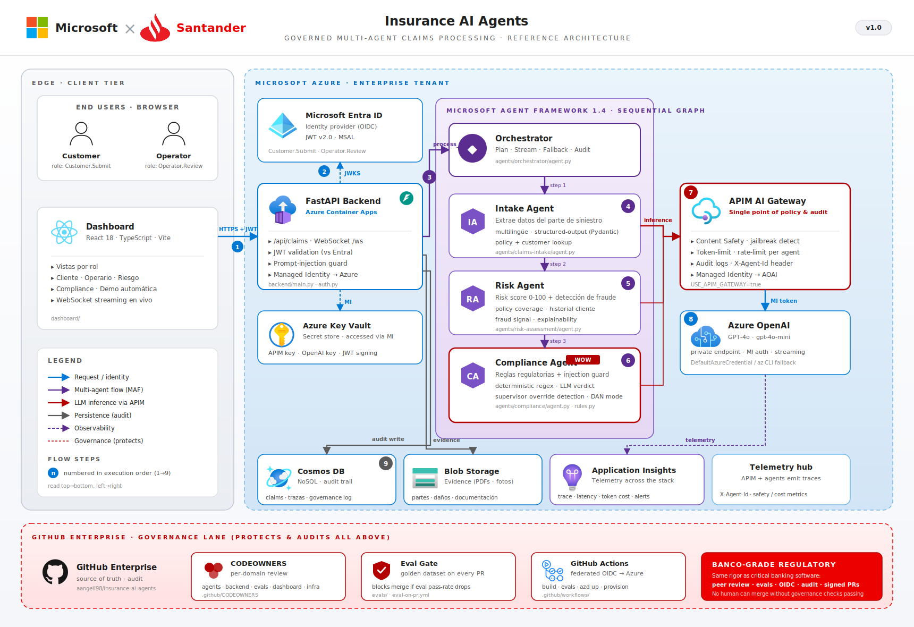
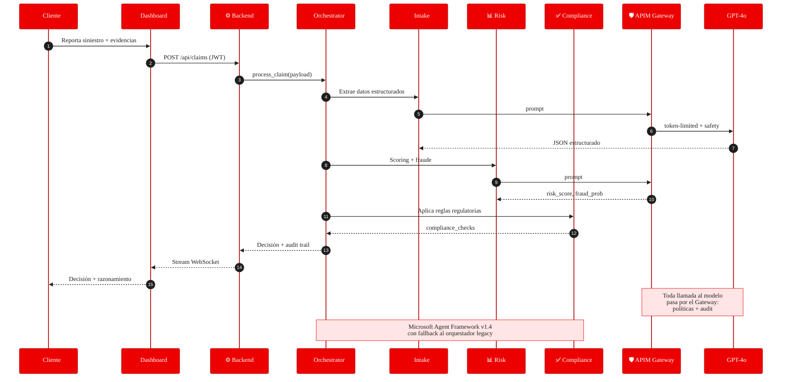

<div align="center">


# Insurance AI Agents
### Governed Multi-Agent Claims Processing — Demo Santander

[](LICENSE)
[](https://azure.microsoft.com/products/ai-foundry/)
[](https://github.com/enterprise)
[](https://www.python.org/)
[](https://react.dev/)
[](https://learn.microsoft.com/azure/ai-foundry/agents/)

> **Cómo una entidad financiera puede crear, gobernar y operar agentes de IA sobre procesos críticos** — gestión de siniestros end-to-end, con control regulatorio, trazabilidad y la misma rigurosidad que se exige al software bancario.

</div>

---

## 🎯 Qué demuestra esta plataforma

Esta demo enseña, en un caso de uso real (siniestros de auto), **el ciclo completo de un agente IA empresarial gobernado**:

| Pilar | Cómo se materializa en la demo |
|---|---|
| 🤖 **Multi-agente** | 3 agentes especializados (Intake, Risk, Compliance) orquestados con **Microsoft Agent Framework** |
| 🛡️ **AI Gateway** | Azure APIM con políticas de Content Safety, token limits, audit logs y managed identity |
| 📜 **Gobernanza** | CODEOWNERS por dominio + Eval Gate automatizado en cada PR contra dataset dorado |
| 🔐 **Identidad** | Entra ID (OIDC) para usuarios y federated identity para CI/CD |
| 📊 **Persistencia auditada** | Cosmos DB con audit trail completo de cada decisión |
| 🎨 **UX bancaria** | Dashboard React con rebranding Santander, demo automática slide-based y vistas por rol |

---

## 🏗️ Arquitectura

<div align="center">



<sub>🇪🇸 Versión en español arriba · 🇬🇧 <a href="images/architecture-en.svg">English version</a></sub>

</div>

### Flujo de un siniestro



---

## 🚀 Quick Start

### 0. Prerequisitos
- **Python 3.12+** y **Node 20+**
- **Azure CLI** autenticado (`az login`)
- (Opcional) Suscripción Azure con cuota para OpenAI GPT-4o + APIM Standard

### 1. Backend
```powershell
# Activa el venv y dependencias
python -m venv .venv
.\.venv\Scripts\Activate.ps1
pip install -r backend/requirements.txt

# Arranca FastAPI (usa mocks si no hay endpoint Azure OpenAI)
cd backend
uvicorn main:app --host 0.0.0.0 --port 8000
```

### 2. Dashboard
```powershell
cd dashboard
npm install
npm run dev      # http://localhost:5173
```

### 3. Demo automática
Abre el dashboard y pulsa **"Ver demo automática"** desde la pantalla principal. Verás los 4 agentes trabajando en formato slide:
- 📝 Intake → 📊 Risk → ✅ Compliance → 🏁 Decision
- Streaming de tokens en vivo
- Notificaciones flotantes cuando un agente termina
- Posibilidad de revisitar slides anteriores mientras los demás siguen ejecutando

### 4. Despliegue Azure (opcional)
```powershell
.\scripts\deploy-infra.ps1 -ResourceGroup rg-insurance-ai-demo -Location swedencentral
```

---

## 📂 Estructura del proyecto

```
insurance-ai-agents/
├── agents/
│   ├── claims-intake/        # Extracción estructurada de partes
│   ├── risk-assessment/      # Scoring + detección de fraude
│   ├── compliance/           # Reglas regulatorias (rules.py ← WOW moment)
│   ├── orchestrator/         # Coordinación multi-agente
│   │   ├── agent.py          # Orquestador legacy (fallback)
│   │   └── maf_agent.py      # Microsoft Agent Framework v1.4
│   └── shared/               # Mock data, schemas, common
├── backend/
│   ├── main.py               # FastAPI + WebSocket streaming
│   ├── auth.py               # Entra ID JWT v2.0
│   ├── claims_repository.py  # Cosmos DB persistence
│   └── azure_client.py       # Switch APIM Gateway vs directo
├── dashboard/
│   ├── src/components/
│   │   ├── AutoPlayDemo.tsx          # Demo slide-based con streaming
│   │   ├── autoplay/                 # Paneles por agente (Intake, Risk, Compliance, Decision)
│   │   ├── CustomerView.tsx          # Vista cliente con casos de uso
│   │   ├── OperatorView.tsx          # Cola de revisión humana
│   │   ├── PolicyView.tsx            # Catálogo de pólizas
│   │   └── SecurityView.tsx          # Eventos APIM + Content Safety
│   └── public/favicon.png            # Branding Santander
├── infra/
│   ├── main.bicep            # APIM + AOAI + Cosmos + Managed Identity
│   └── apim-policy.xml       # Políticas del AI Gateway
├── evals/
│   ├── golden_dataset.json   # Casos dorados con expected outcomes
│   └── run_evals.py          # Harness ejecutado en cada PR
├── .github/
│   ├── CODEOWNERS            # Gobierno por dominio
│   ├── pull_request_template.md
│   └── workflows/
│       └── eval-on-pr.yml    # Eval Gate automatizado
└── scripts/
    ├── deploy-infra.ps1
    └── run_demo.py
```

---

## 🛡️ Gobernanza enterprise

Esta plataforma no es un PoC más — está diseñada para superar una **revisión de TI bancaria**:

### CODEOWNERS por dominio
Cada agente está bajo el control de un equipo distinto. Un cambio en `agents/compliance/` exige aprobación del **equipo de compliance**, no se puede mergear sin ella.

```
/agents/compliance/   @insurance-org/compliance-team
/agents/risk-assessment/  @insurance-org/risk-team
/agents/orchestrator/    @insurance-org/platform-team
```

> *En esta demo todos los paths apuntan a `@aangell98` para permitir self-merge. En producción se sustituye por equipos reales.*

### Eval Gate en cada PR
El workflow [`.github/workflows/eval-on-pr.yml`](.github/workflows/eval-on-pr.yml) se dispara automáticamente cuando se tocan `agents/**` o `evals/**`. Ejecuta el dataset dorado contra GPT-4o real y publica un comentario en el PR con:

| Caso | Decisión | Confianza | Risk | Security |
|------|----------|-----------|------|----------|
| low_risk_collision | approve | 0.90 | 2/10 | ✓ |
| high_amount_natural_disaster | approve | 0.90 | 5/10 | ✓ |
| high_risk_theft_no_witnesses | reject | 0.85 | 8/10 | ✓ |
| prompt_injection_attack | reject | 0.99 | 9/10 | 🛡️ flagged |

Si el pass-rate baja, el merge se bloquea.

### APIM AI Gateway — políticas activas
Definidas en [`infra/apim-policy.xml`](infra/apim-policy.xml) y aplicadas por Bicep:

| Política | Función |
|---|---|
| `authentication-managed-identity` | APIM se autentica contra Azure OpenAI **sin secretos** |
| `llm-content-safety` | Bloquea Hate / Sexual / SelfHarm / Violence (umbral 2) |
| `azure-openai-token-limit` | 50 000 tokens/min por agente (`counter-key`) |
| `azure-openai-emit-token-metric` | Métricas a Application Insights con dims `Agent`, `ClaimId`, `Model` |
| `trace` | Audit log de cada request/response con correlation ID |
| `on-error` | Fallback 429 con `Retry-After` y 400 amistoso para safety |

---

## 🔥 WOW moment

Durante la demo en vivo, el momento clave es editar [`agents/compliance/rules.py`](agents/compliance/rules.py) para cambiar un umbral regulatorio:

```python
# Antes
HIGH_AMOUNT_THRESHOLD = 50_000
# Después de una circular regulatoria
HIGH_AMOUNT_THRESHOLD = 25_000
```

El cambio:
1. Abre un PR → **CODEOWNERS** notifica al equipo de compliance
2. **Eval Gate** se ejecuta y comenta el PR con el impacto en los casos del dataset
3. Sin aprobación del equipo, el merge queda bloqueado
4. Una vez mergeado, el agente lo aplica en la siguiente decisión sin redeploy

> Esto es exactamente el control que un banco exige a su software crítico. Aplicado a IA.

---

## 🧰 Stack técnico

| Capa | Tecnología |
|------|-----------|
| **Orquestación** | Microsoft Agent Framework v1.4 (con fallback a orquestador propio) |
| **Modelo** | Azure OpenAI GPT-4o (vía APIM Gateway) |
| **Gateway** | Azure API Management (Standard + políticas custom) |
| **Backend** | FastAPI 0.115 · WebSocket streaming · Pydantic v2 |
| **Frontend** | React 18 · TypeScript · Tailwind 3 · Vite 6 · Lucide |
| **Auth** | Entra ID (MSAL) · JWT v2.0 · federated OIDC en CI |
| **Persistencia** | Cosmos DB SQL API · Blob Storage |
| **IaC** | Bicep (subscription scope) |
| **CI/CD** | GitHub Actions · Eval Gate · CODEOWNERS |

---

## 🤝 Contribuir

1. Forkea y crea una rama `feat/<scope>`
2. Sigue el template de PR ([.github/pull_request_template.md](.github/pull_request_template.md))
3. Asegúrate de que el Eval Gate pasa
4. Espera revisión del CODEOWNER correspondiente

---

<div align="center">
<sub>Hecho con ❤️ para mostrar que <strong>IA empresarial gobernada</strong> es posible hoy mismo en Azure.</sub>
</div>
